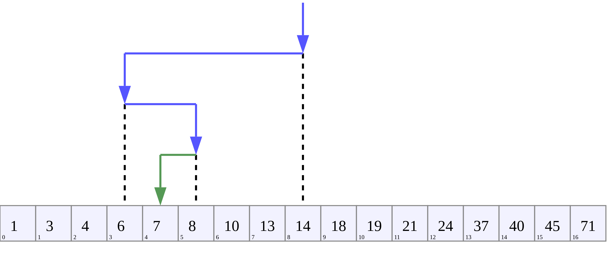

# Бинарный поиск (Binary Search)

Бинарный поиск известен так же как метод деления пополам. 
На входе должен быть отсортированный список элементов. 
Каждая итерация поиска исключает половину массива. 

## Сложность
O(log(n))