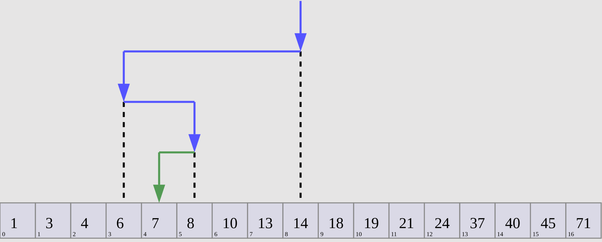

# Бинарный поиск (Binary Search)

Бинарный поиск известен так же как метод деления пополам. 
На входе должен быть отсортированный список элементов. 
Каждая итерация поиска исключает половину массива. 

## Сложность
O(log(n))

Полезные ссылки:
* [wiki](https://ru.wikipedia.org/wiki/%D0%94%D0%B2%D0%BE%D0%B8%D1%87%D0%BD%D1%8B%D0%B9_%D0%BF%D0%BE%D0%B8%D1%81%D0%BA)