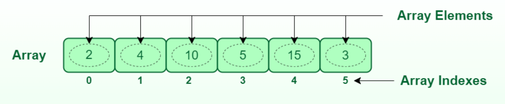

# Array (Массив) 

Массив - это структура данных, состоящая из набора элементов (значений или переменных) одинакового объема памяти, каждый из которых идентифицируется по крайней мере одним индексом массива или ключом. Элементы массива пронумерованы, причем нумерация начинается с 0. В массиве все элементы хранятся в пямяти рядом друг с другом. Все элементы массива должны быть однотипные.

| Data Structure                | Чтение | Поиск | Вставка | Удаление |
| :---------------------------- | :----- | :---- | :------ | :------- |
| Array (Массив)                | O(1)   | O(n)  | O(n)    | O(n)     |

Полезные ссылки:
* [wiki](https://ru.wikipedia.org/wiki/%D0%9C%D0%B0%D1%81%D1%81%D0%B8%D0%B2_(%D1%82%D0%B8%D0%BF_%D0%B4%D0%B0%D0%BD%D0%BD%D1%8B%D1%85))