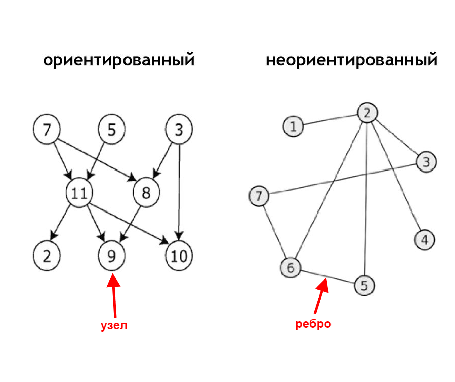

# Graph (Граф)

 Граф - структура данных, которая используется для моделирования связей между разными объектами. Граф состоит из набора узлов и ребер. Узлы могут быть напрямую соединены с несколькими другими узлами. 

 Структура данных графа состоит из набора вершин (также называемых узлами или точками) вместе с набором неупорядоченных пар этих вершин для неориентированного графа или набором упорядоченных пар для ориентированного графа. Эти пары известны как ребра (также называемые связями или линиями), а для ориентированного графа также известны как ребра, но иногда также как стрелки.

| Data Structure                | Чтение | Поиск | Вставка | Удаление |
| :---------------------------- | :----- | :---- | :------ | :------- |
| Graph (Граф)                  | -      | -     | -       | -        |

Полезные ссылки:
* [wiki](https://ru.wikipedia.org/wiki/%D0%93%D1%80%D0%B0%D1%84_(%D0%BC%D0%B0%D1%82%D0%B5%D0%BC%D0%B0%D1%82%D0%B8%D0%BA%D0%B0)#%D0%9E%D0%B1%D0%BE%D0%B1%D1%89%D0%B5%D0%BD%D0%B8%D0%B5_%D0%BF%D0%BE%D0%BD%D1%8F%D1%82%D0%B8%D1%8F_%D0%B3%D1%80%D0%B0%D1%84%D0%B0)