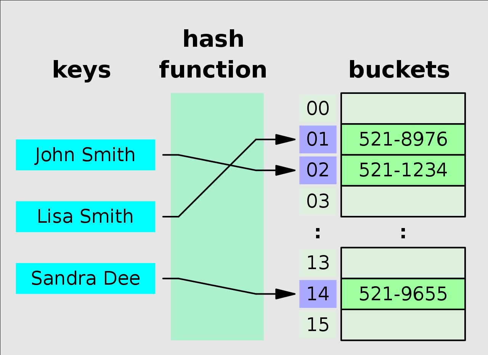
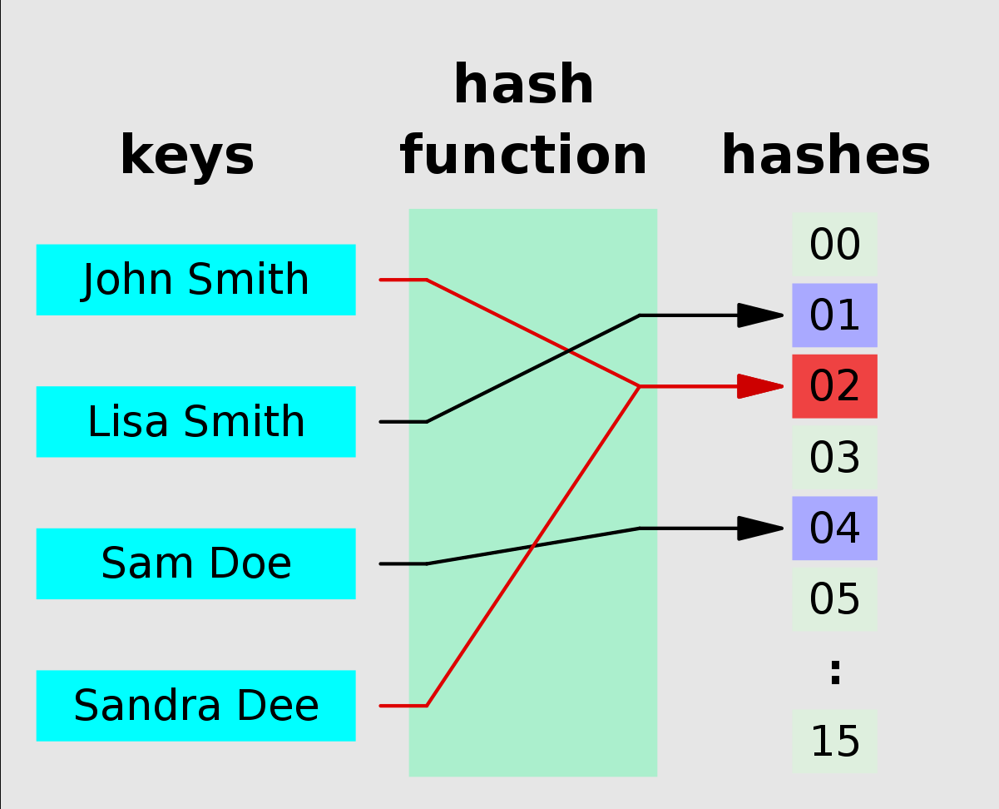

# Hash-table (Хэш-таблица) 

 Хэш-таблица - это структура данных, реализующая интерфейс ассоциативного массива, а именно, она позволяет хранить пары (ключ, значение). Хэш-таблицы обеспечивают быстрые операцию добавления, операцию удаления и операцию поиска пары по ключу. Хорошо подходят для обнаружения дубликатов, т.к. в идеале хэш-функция должна присваивать элементу уникальный ключ.

 Бывают ситуации когда двум ключам таблицы назначается один индекс в массиве - это называется Коллизия. Самые распространенные стратегии обработки коллизии: создание связного списка на этом элементе или создания открытой адресации (т.е. помещать элемент в свободную ячейку).

| Data Structure                | Чтение | Поиск | Вставка | Удаление |
| :---------------------------- | :----- | :---- | :------ | :------- |
| Hash-table (Хэш-таблица)      | -      | O(1)  | O(1)    | O(1)     |

Полезные ссылки:
* [wiki](https://ru.wikipedia.org/wiki/%D0%A5%D0%B5%D1%88-%D1%82%D0%B0%D0%B1%D0%BB%D0%B8%D1%86%D0%B0)