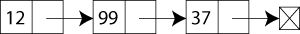

# Linked Liset (Связный список)

При использовании связного списка элементы могут размещаться где угодно в памяти. В каждом элементе хранится адрес следующего элемента списка. Таким образом, набор произвиольных адресов в памяти объединяется в цепочку.

| Data Structure                | Чтение | Поиск | Вставка | Удаление |
| :---------------------------- | :----- | :---- | :------ | :------- |
| Linked Liset (Связный список) | O(n)   | O(n)  | O(1)    | O(1)     |

Полезные ссылки:
* [wiki](https://ru.wikipedia.org/wiki/%D0%A1%D0%B2%D1%8F%D0%B7%D0%BD%D1%8B%D0%B9_%D1%81%D0%BF%D0%B8%D1%81%D0%BE%D0%BA)