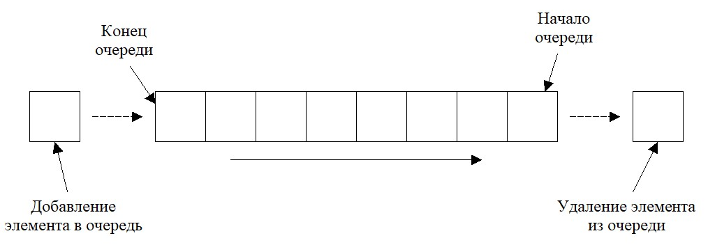

# Queue (Очередь)

Очередь - абстрактный тип данных, представляющий собой список элементов, организованных принципу FIFO (англ. first in - first out, «первый пришёл — первый вышел»). Добавление элемента возможно лишь в конец очереди, выборка — только из начала очереди, при этом выбранный элемент из очереди удаляется.

| Data Structure                | Чтение | Поиск | Вставка | Удаление |
| :---------------------------- | :----- | :---- | :------ | :------- |
| Queue (Очередь)               | O(n)   | O(n)  | 1       | 1        |

Полезные ссылки:
* [wiki](https://ru.wikipedia.org/wiki/%D0%9E%D1%87%D0%B5%D1%80%D0%B5%D0%B4%D1%8C_(%D0%BF%D1%80%D0%BE%D0%B3%D1%80%D0%B0%D0%BC%D0%BC%D0%B8%D1%80%D0%BE%D0%B2%D0%B0%D0%BD%D0%B8%D0%B5))