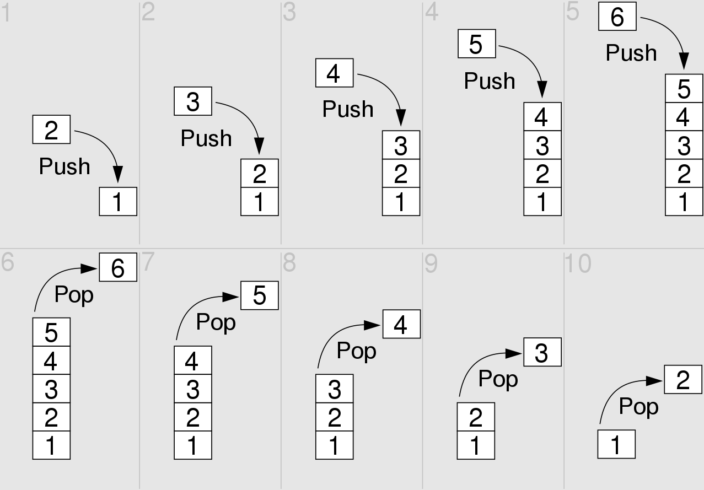

# Stack (Стек)

Стек - абстрактный тип данных, представляющий собой список элементов, организованных по принципу LIFO (англ. last in — first out, «последним пришёл — первым вышел»).

Возможны три операции со стеком: добавление элемента (иначе проталкивание, push), удаление элемента (pop) и чтение головного элемента (peek).

| Data Structure                | Чтение | Поиск | Вставка | Удаление |
| :---------------------------- | :----- | :---- | :------ | :------- |
| Stack (Стэк)                  | O(n)   | O(n)  | 1       | 1        |

Полезные ссылки:
* [wiki](https://ru.wikipedia.org/wiki/%D0%A1%D1%82%D0%B5%D0%BA)